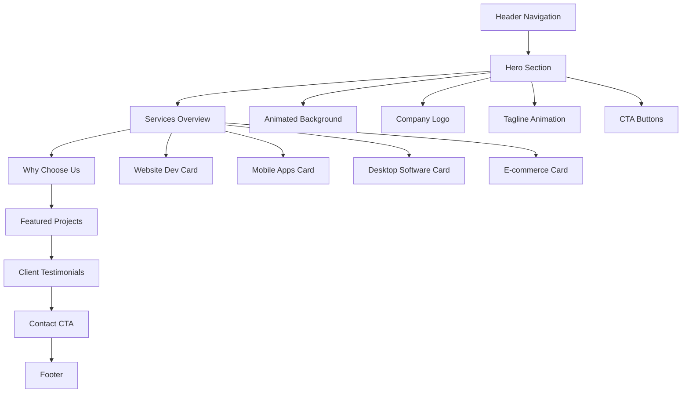
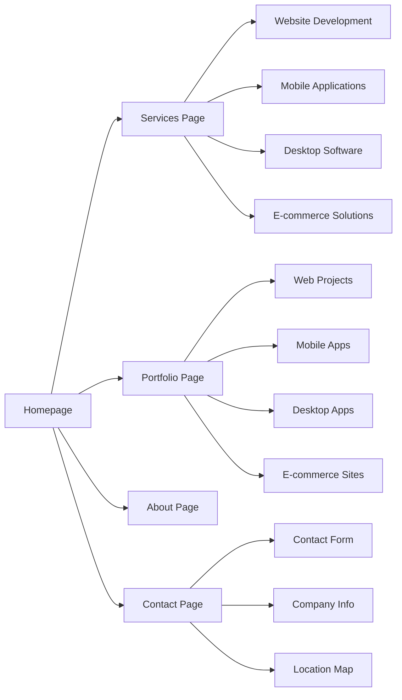
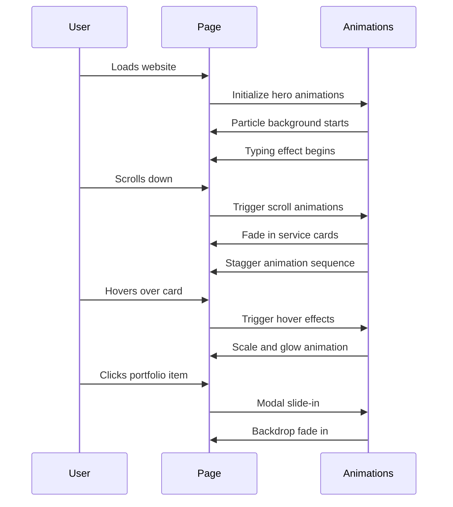
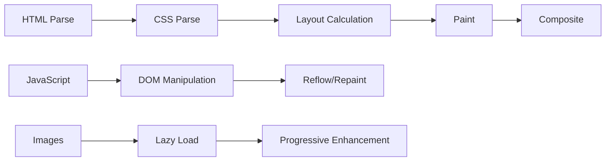

# CV Solusi Surabaya - Website Wireframes

## Homepage Layout Structure



## Page Flow Architecture



## Responsive Layout Breakpoints

### Mobile Layout (320px - 767px)
```
┌─────────────────────┐
│      Header         │
├─────────────────────┤
│                     │
│    Hero Section     │
│   (Full Width)      │
│                     │
├─────────────────────┤
│   Service Card 1    │
├─────────────────────┤
│   Service Card 2    │
├─────────────────────┤
│   Service Card 3    │
├─────────────────────┤
│   Service Card 4    │
├─────────────────────┤
│      Footer         │
└─────────────────────┘
```

### Tablet Layout (768px - 991px)
```
┌─────────────────────────────────┐
│           Header                │
├─────────────────────────────────┤
│                                 │
│         Hero Section            │
│        (Full Width)             │
│                                 │
├─────────────────────────────────┤
│  Service 1  │    Service 2      │
├─────────────┼───────────────────┤
│  Service 3  │    Service 4      │
├─────────────────────────────────┤
│            Footer               │
└─────────────────────────────────┘
```

### Desktop Layout (992px+)
```
┌─────────────────────────────────────────────────┐
│                  Header                         │
├─────────────────────────────────────────────────┤
│                                                 │
│              Hero Section                       │
│             (Full Width)                        │
│                                                 │
├─────────────────────────────────────────────────┤
│ Service 1 │ Service 2 │ Service 3 │ Service 4   │
├─────────────────────────────────────────────────┤
│                   Footer                        │
└─────────────────────────────────────────────────┘
```

## Component Wireframes

### Header Component
```
┌─────────────────────────────────────────────────┐
│ [Logo] CV Solusi    [Home][Services][Portfolio] │
│        Surabaya     [About][Contact] [Menu ☰]   │
└─────────────────────────────────────────────────┘
```

### Hero Section
```
┌─────────────────────────────────────────────────┐
│              [Animated Background]              │
│                                                 │
│         CV SOLUSI SURABAYA                      │
│    Solusi Digital Terpercaya Untuk Bisnis      │
│              Anda                               │
│                                                 │
│    [Lihat Layanan]  [Hubungi Kami]            │
│                                                 │
└─────────────────────────────────────────────────┘
```

### Service Card Component
```
┌─────────────────────────┐
│      [Icon/Image]       │
│                         │
│    Service Title        │
│                         │
│  Brief description of   │
│  the service offered    │
│                         │
│    [Learn More]         │
└─────────────────────────┘
```

### Portfolio Card Component
```
┌─────────────────────────┐
│                         │
│    [Project Image]      │
│                         │
├─────────────────────────┤
│   Project Title         │
│   Technology Used       │
│   [View Details]        │
└─────────────────────────┘
```

## Animation Flow Diagram



## Interactive Elements Map

### Homepage Interactions
1. **Hero Section**
   - Animated typing effect for tagline
   - Particle background animation
   - CTA button hover effects

2. **Services Section**
   - Card hover animations (scale + glow)
   - Stagger animation on scroll
   - Icon animations on hover

3. **Portfolio Preview**
   - Image lazy loading
   - Modal popup on click
   - Filter animations

4. **Contact Section**
   - Form validation animations
   - Success/error feedback
   - Button ripple effects

### Navigation Interactions
1. **Desktop Navigation**
   - Smooth scroll to sections
   - Active state indicators
   - Hover underline animations

2. **Mobile Navigation**
   - Hamburger menu animation
   - Slide-in menu panel
   - Overlay backdrop

## Performance Considerations

### Critical Rendering Path


### Loading Strategy
1. **Above the fold**: Critical CSS inline
2. **Hero section**: Priority loading
3. **Images**: Lazy loading with placeholders
4. **Animations**: Load after critical content
5. **Third-party**: Defer non-critical scripts

## Accessibility Wireframe Notes

### Keyboard Navigation Flow
```
Header Logo → Nav Menu → Hero CTA → Service Cards → 
Portfolio Items → Contact Form → Footer Links
```

### Screen Reader Structure
- Proper heading hierarchy (H1 → H2 → H3)
- Alt text for all images
- ARIA labels for interactive elements
- Skip navigation links
- Focus indicators for all interactive elements

### Color Contrast Compliance
- Text on dark background: #ffffff on #0a0a0a (21:1 ratio)
- Accent text: #00d4ff on #0a0a0a (12.6:1 ratio)
- Secondary text: #b3b3b3 on #0a0a0a (9.7:1 ratio)